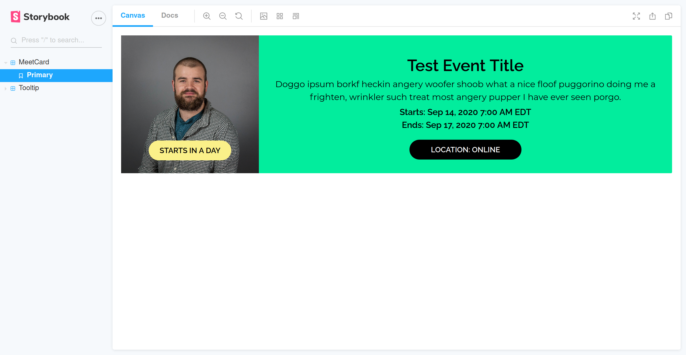

## Local development workflow

`yarn install`

`yarn start`

Make sure the backend server and postgres is also working in separate tabs (see backend repo for instructions).

### Environment variables

Create a `.env` file in the project root. Add environment variable keys and values. Copy keys `.env.sample` and populate with actual values.

Note: you can access environment variables in frontend with `process.env.VAR_NAME`

### Error handling

Graphql is unlike REST in that you have great freedom in querying what you want from a single endpoint.

With great freedom comes great responsibility. Some errors are returned from server with status 200 with null data and an array of errors. [Here's a great breakdown](https://medium.com/@sachee/200-ok-error-handling-in-graphql-7ec869aec9bc).

Here is what a response from the backend API looks like

```ts
interface ApiResponseRaw<T> {
  data: T;
  errors?: ServerError[];
}
```

Apollo server errors come with a few goodies, but we will only pluck these ones:

```ts
interface ServerError {
  message: string;
  extensions: { code: string };
}
```

We will soon all migrate error handling logic to the Service layer. At present, api calls that go through the redux store are being handled in action creators, while non redux store services are handled in Service layer.

See `authActions.ts`,`AuthService`, and `AuthDaoImpl.ts` as an example API request/response flow. The Dao should be typed to only return the expected success response data type. Any expected errors must be thrown.

See `fetchMeets()` in `MeetsDao` and `MeetsService` flow for example of non-redux store data service. Services can be accessed from `context`.

### Logging

The `LoggerService` can be used to notify the user of the results of events via Toasts (little flash messages). It can be accessed from `context`. It additionally adds a `LoggedError` to `state.errors` (our temporary error logger) when `loggerService.danger(...)` or it's extension `loggerService.handleGraphqlErrors(...)` is called. By default, all loggerService methods (`success`,`info`,`warning`,`danger`, `handleGraphqlErrors`) send Toasts to `state.toasts` and the UI, but if you have an error that you want to log silently you can add an extra argument `true` to the `danger()` or `handleGraphqlErrors()` methods.

Use logger sparingly and only as helpful - don't piss off users. (DO use `handleGraphqlErrors()` or `danger` for all errors though so we can capture them, with at least silent `true`.)

| method                                                  | when to use?                                                                                                                                                                                                                             |
| ------------------------------------------------------- | ---------------------------------------------------------------------------------------------------------------------------------------------------------------------------------------------------------------------------------------- |
| `success(message: string): void`                        | Whens something goes right and you want to tell the user                                                                                                                                                                                 |
| `info(message: string): void`                           | Whens you have some neutral info to share. Like just sayin' hi                                                                                                                                                                           |
| `warning(message: string): void`                        | When something is fishy but isn't a breaking error                                                                                                                                                                                       |
| `danger(message: string, silent = false): void`         | When you need to log a custom error. For example, overriding an Apollo Server error on failed login as to not reveal explicit errors like 'wrong password' for security reasons. Or for throwing errors that aren't Apollo Server errors |
| `handleGraphqlErrors(error: any, silent = false): void` | PREFERRED. When handling and logging Apollo errors from backed. Will throw an ambiguous error if anything other than error with type `ServerError[]` is passed                                                                           |

`handleGraphqlErrors` should always be used to handle errors from the backend API, which are sent as an array. Append argument `true` to log errors silently (without sending Toast).

Here is an example of handling and logging a `fetchUsers` response in the `userActions` (TODO: migrate logic to service layer):

```ts
export function fetchUsers(): ThunkAction<void, StoreState, Context, MbAction<void>> {
  return (dispatch: Dispatch, _getState, context) => {
    dispatch(action("LOADING"));
    return context.userService
      .fetchUsers()
      .then((users) => {
        if (!users) {
          dispatch(action("ERROR"));
          throw null; // <-- direct flow to catch block with ambiguous error
        }
        context.loggerService.success("Successfully fetched users!"); // <-- sends 'success' toast
        return dispatch(action("SUCCESS", users));
      })
      .catch((err) => {
        context.loggerService.handleGraphqlErrors(err); // <-- handles ServerError[] or ambiguous error. Toasts and logs.
        return dispatch(action("ERROR"));
      });
  };
}
```

### Testing

See `authActions.test.ts` and `TestAuthDao` for an example of mocking responses and testing for expectations.

Once setting up a `mockReturn()` method in your `TestXXXDao` like in `TestAuthDao`, you can mock responses in tests by using `.configureContext(...)`

Here is a sample test for an expected success scenario (mockReturn arg shape is `{data: Something}`)

```ts
it("Updates state.user and throws Toast on successful login", async () => {
  await testManager
    // fake a successful login by returning user
    .configureContext((context) => {
      context.authDao.mockReturn({ data: fakeUser }); // <-- { data: Something}
    })
    .dispatchThunk<User>(login({ email: TEST_EMAIL, password: TEST_PASSWORD }))
    .then((tm) => {
      const results = tm.getResults();

      expect(results[0].user.loadStatus).toBe("LOADING");
      expect(results[0].user.data).toBe(undefined);

      // returns user on success
      const finalState = results.length - 1;
      expect(results[finalState].user.loadStatus).toBe("SUCCESS");
      expect(results[finalState].user.data).toMatchObject(JSON.parse(JSON.stringify(fakeUser)));
      expect(results[finalState].toasts[0].type).toBe("SUCCESS");
    });
});
```

Here is a sample test for an expected error scenario (`mockReturn` arg shape is `{ data: null, errors: ServerError[]}`)

```ts
it("Registers error loadStatus for state.user, logs error and throws Toast on failed login, ", async () => {
  const ERROR_CODE = "AMBIGUOUS_ERROR";
  await testManager
    // fake a bad login by forcing errors in dao return
    .configureContext((context) => {
      context.authDao.mockReturn({
        data: null,
        errors: [{ message: "test err", extensions: { code: ERROR_CODE } }],
      }); // <-- { data: null, errors: ServerError[] }
    })
    .dispatchThunk<User>(login({ email: TEST_EMAIL, password: TEST_PASSWORD }))
    .then((tm) => {
      const results = tm.getResults();

      expect(results[0].user.loadStatus).toBe("LOADING");
      expect(results[0].user.data).toBe(undefined);

      const finalState = results.length - 1;
      expect(results[finalState].user.loadStatus).toBe("ERROR");
      expect(results[finalState].user.data).toBe(undefined);
      expect(results[finalState].errors[0].code).toBe(ERROR_CODE);
      expect(results[finalState].errors[0].message).toBe("Login failed.");
      expect(results[finalState].toasts[0].type).toBe("DANGER");
      expect(results[finalState].toasts[0].message).toBe("Login failed.");
    });
});
```

See `meetService.test.ts` for example of calling api service that doesn't touch redux store, using `TestManager`'s `execute()` method.

### Markdown

We are using `react-markdown` (built on `markdown-it`) to parse markdown text into html.

[See here](https://www.npmjs.com/package/react-markdown-it#usage) for usage example.

### Debugging in VSCode

In VSCode, you can go over to the "Run" tab on the left-hand panel and run "Debug Jest tests". This will let you set breakpoints in VSCode itself. How cool is that?

## Storybook

Run `yarn storybook` to view libary of componants


