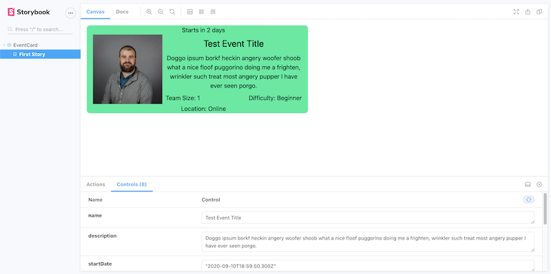

## Local development workflow

`yarn install`

`yarn start`

Make sure the backend server and postgres is also working in separate tabs (see backend repo for instructions).

### Error handling

Graphql is unlike REST in that you have great freedom in querying what you want from a single endpoint.

With great freedom comes great responsibility. Some errors are returned from server with status 200 with null data and an array of errors. [Here's a great breakdown](https://medium.com/@sachee/200-ok-error-handling-in-graphql-7ec869aec9bc).

Here is was a response from the backend API looks like

```ts
interface ApiResponseRaw<T> {
  data: T;
  errors?: ServerError[];
}
```

This means we have to check responses in the Dao for presence of `res.errors` to know whether to throw an error. We catch and handle the error in Service layer as it is most universally traversed.

Apollo server errors come with a few goodies, but we will only pluck these ones:

```ts
interface ServerError {
  message: string;
  extensions: { code: string };
}
```

Our Daos will pass the whole response object (`{ data, errors? }`) up to the proper service, where it is checked for errors.

See `AuthDaoImpl.ts` and `AuthService` as examples of how to throw and handle graphql errors.

### Logging

The `LoggerService` can used to notify the user of the results of events via Toasts (little flash messages). It can be accessed from Services and context. It additionally adds a `LoggedError` to `state.errors` (our temporary error logger) when `logger.danger(...)` is called. By default, all logger types (`success`,`info`,`warning`,`danger`) send Toasts to `state.toasts` and the UI, but if you have an error that you want to log silently you can add a 3rd argument `true` to the `danger()` method.

Use sparingly only as helpful - don't piss off users. (Do use `danger` for all errors though so we can capture them, with at least silent `true`.)

| method                                                  | when to use?                                                   |
| ------------------------------------------------------- | -------------------------------------------------------------- |
| `success(message: string): void`                        | Whens something goes right and you want to tell the user       |
| `info(message: string): void`                           | Whens you have some neutral info to share. Like just sayin' hi |
| `warning(message: string): void`                        | When something                                                 |
| `danger(message: string                                 | null, code?: string                                            | null, silent = false): void` | When you need to log a custom error |
| `handleGraphqlErrors(error: any, silent = false): void` | **When handling and logging Apollo errors from backed**        |

`handleGraphqlErrors` should always be used to handle errors from the backend API, which are sent as an array. Use `true` as 2nd argument to log errors without sending Toast.

Here is an example of handling and logging a `fetchUsers` response in the `UserService`:

```ts
export class UserService {
  constructor(private userDao: UserDao, private logger: LoggerService) {}

  fetchUsers(): Promise<User[] | void> {
    // will log backend errors and announce them to user as Toast
    return this.userDao.fetchUsers().catch((e) => this.logger.handleGraphqlErrors(e));
  }
}
```

### Testing

See `authActions.test.ts` and `TestAuthDao` for an example of mocking responses and testing for expectations.

Once setting up a `mockReturn()` method in your `TestXXXDao` like in `TestAuthDao`, you can mock responses in tests by using `.configureContext(...)`

Here is a sample test for an expected success scenario (mockReturn arg shape is `{data: Something}`)

```ts
it("Updates state.user and throws Toast on successful login", async () => {
  await testManager
    // fake a successful login by returning user
    .configureContext((context) => {
      context.authDao.mockReturn({ data: fakeUser }); // <-- { data: Something}
    })
    .dispatchThunk<User>(login({ email: TEST_EMAIL, password: TEST_PASSWORD }))
    .then((tm) => {
      const results = tm.getResults();

      expect(results[0].user.loadStatus).toBe("LOADING");
      expect(results[0].user.data).toBe(undefined);

      // returns user on success
      const finalState = results.length - 1;
      expect(results[finalState].user.loadStatus).toBe("SUCCESS");
      expect(results[finalState].user.data).toMatchObject(JSON.parse(JSON.stringify(fakeUser)));
      expect(results[finalState].toasts[0].type).toBe("SUCCESS");
    });
});
```

Here is a sample test for an expected error scenario (`mockReturn` arg shape is `{ data: null, errors: ServerError[]}`)

```ts
it("Registers error loadStatus for state.user, logs error and throws Toast on failed login, ", async () => {
  const ERROR_CODE = "AMBIGUOUS_ERROR";
  await testManager
    // fake a bad login by forcing errors in dao return
    .configureContext((context) => {
      context.authDao.mockReturn({
        data: null,
        errors: [{ message: "test err", extensions: { code: ERROR_CODE } }],
      }); // <-- { data: null, errors: ServerError[] }
    })
    .dispatchThunk<User>(login({ email: TEST_EMAIL, password: TEST_PASSWORD }))
    .then((tm) => {
      const results = tm.getResults();

      expect(results[0].user.loadStatus).toBe("LOADING");
      expect(results[0].user.data).toBe(undefined);

      const finalState = results.length - 1;
      expect(results[finalState].user.loadStatus).toBe("ERROR");
      expect(results[finalState].user.data).toBe(undefined);
      expect(results[finalState].errors[0].code).toBe(ERROR_CODE);
      expect(results[finalState].errors[0].message).toBe("Login failed.");
      expect(results[finalState].toasts[0].type).toBe("DANGER");
      expect(results[finalState].toasts[0].message).toBe("Login failed.");
    });
});
```

### Debugging in VSCode

In VSCode, you can go over to the "Run" tab on the left-hand panel and run "Debug Jest tests". This will let you set breakpoints in VSCode itself. How cool is that?

## Storybook

Run `yarn storybook` to view libary of componants


